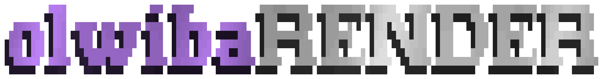

<p align="center">
  <picture>
    <source media="(prefers-color-scheme: light)" srcset="./public/olwibaRENDER--light.gif" />
    <source media="(prefers-color-scheme: dark)" srcset="./public/olwibaRENDER.gif" />
    
  </picture>
</p>

<p align="center">
  <strong>JSON-to-UI rendering for Olwiba projects.</strong>
</p>

<p align="center">
  <a href="https://render.olwiba.com">Documentation</a>
</p>

<p align="center">
  <a href="https://github.com/Olwiba/olwibaRENDER/issues/new?template=bug_report.md">🪲 Report a bug</a> ·
  <a href="https://github.com/Olwiba/olwibaRENDER/issues/new?template=feature_request.md">✨ Feature request</a>
</p>

<p align="center">
  <a href="https://github.com/sponsors/Olwiba"></a>
  <a href="LICENSE"></a>
  <a href="https://github.com/Olwiba/olwibaRENDER/issues"></a>
</p>

## What This Is

`@olwiba/render` is the `@olwiba/ui` adapter for [`@json-render/react`](https://json-render.dev).

It lets you describe UI declaratively as a JSON spec and renders it using the full Olwiba component library. Useful for AI-generated pages, dynamic dashboard layouts, or any surface where structure comes from data rather than code.

## Installation

```bash
bun add @olwiba/render
```

Peer dependencies: `@olwiba/cn`, `@olwiba/ui`, `react`, `react-dom`, `zod`

```tsx
import { RenderPage } from '@olwiba/render';

const spec = {
  root: 'header-1',
  elements: {
    'header-1': {
      type: 'PageHeader',
      props: { title: 'Dashboard', description: 'Welcome back' },
      children: ['card-1'],
    },
    'card-1': {
      type: 'StatCard',
      props: { label: 'Users', value: '1,234', delta: '+12%', trend: 'up' },
      children: [],
    },
  },
};

function DashboardPage() {
  return (
    <RenderPage
      spec={spec}
      onAction={{ navigate: (p) => router.navigate(p.to) }}
    />
  );
}
```

## What's Included

**RenderPage** Top-level renderer — pass a spec and action handlers, get a full page  
**defineRegistry** Cherry-pick specific components for a lean custom renderer  
**catalog** Full component registry with Zod-validated prop schemas  
**AI prompting** `catalog.prompt()` generates a system prompt describing all registered components  

## Ecosystem

- [@olwiba/ui](https://github.com/Olwiba/olwibaUI) — the component library being rendered
- [@olwiba/cn](https://github.com/Olwiba/olwibaCN) — base UI primitives
- [@olwiba/sync](https://github.com/Olwiba/olwibaSYNC) — keep @olwiba/* deps up to date

## Contributing

Bug reports, pull requests & feature requests are welcome.
Open an issue first for anything beyond a small fix.

<br/>
<br/>

<p align="center">
  Built with 💖 by <a href="https://github.com/Olwiba">Olwiba</a>
</p>

<p align="center">
  <a href="https://buymeacoffee.com/olwiba"></a>
</p>
